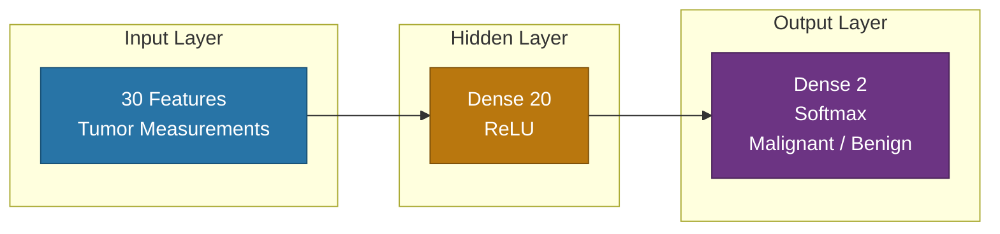
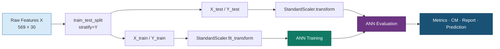
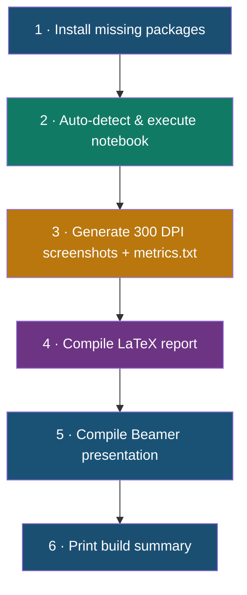

# Breast Cancer Classification with Artificial Neural Networks

[](https://www.python.org/)
[](https://www.tensorflow.org/)
[](https://keras.io/)
[](https://scikit-learn.org/)
[](#disclaimer)

A beginner-friendly **B.Tech AI mini project** that classifies breast tumors as **Malignant** or **Benign** using a compact feed-forward Artificial Neural Network (ANN) built with TensorFlow/Keras on the Breast Cancer Wisconsin dataset.

> **Test Accuracy:** ~**97.37%** &nbsp;|&nbsp; **Parameters:** 662 &nbsp;|&nbsp; **Epochs:** 10

---

## Table of Contents

- [Overview](#overview)
- [Features](#features)
- [Project Workflow](#project-workflow)
- [Dataset](#dataset)
- [Model Architecture](#model-architecture)
- [Data Pipeline](#data-pipeline)
- [Results](#results)
- [Project Structure](#project-structure)
- [Getting Started](#getting-started)
- [Automated Build Pipeline](#automated-build-pipeline)
- [Tech Stack](#tech-stack)
- [Disclaimer](#disclaimer)

---

## Overview

This project demonstrates an end-to-end machine learning workflow:

1. Load and explore the Breast Cancer Wisconsin (Diagnostic) dataset
2. Split and standardize features (no data leakage)
3. Train a simple ANN for binary classification
4. Evaluate with accuracy/loss curves, confusion matrix, and classification report
5. Run a predictive system that returns diagnosis + confidence scores
6. Auto-generate screenshots, metrics, LaTeX report, and Beamer presentation

**Class labels**

| Label | Diagnosis   |
|------:|-------------|
| `0`   | Malignant   |
| `1`   | Benign      |

---

## Features

- Clean, commented Jupyter notebook for beginners
- Stratified train/test split (80% / 20%)
- Feature scaling with `StandardScaler`
- Keras Sequential ANN with ReLU + Softmax
- Accuracy & loss visualization
- Confusion matrix and classification report
- Single-sample prediction with class probabilities
- One-command build script for screenshots, PDF report, and slides

---

## Project Workflow


---

## Dataset

**Source:** Breast Cancer Wisconsin (Diagnostic) — available via `sklearn.datasets.load_breast_cancer()`

| Property              | Value                                      |
|-----------------------|--------------------------------------------|
| Samples               | 569                                        |
| Features              | 30 numeric tumor measurements              |
| Classes               | Malignant (`0`), Benign (`1`)              |
| Train / Test          | 80% / 20% (stratified)                     |
| Preprocessing         | `StandardScaler` (fit on training data)    |

Features describe cell-nucleus characteristics such as radius, texture, perimeter, area, smoothness, compactness, concavity, and related statistics.

---

## Model Architecture



| Layer          | Units | Activation | Role                          |
|----------------|------:|------------|-------------------------------|
| Input          | 30    | —          | Standardized feature vector   |
| Dense (hidden) | 20    | ReLU       | Non-linear feature learning   |
| Dense (output) | 2     | Softmax    | Class probabilities           |

**Training setup**

- Optimizer: `Adam`
- Loss: `sparse_categorical_crossentropy`
- Metric: `accuracy`
- Epochs: `10`
- Validation split: `10%` of training data
- Trainable parameters: **662**

---

## Data Pipeline



---

## Results

Metrics from the automated build (`metrics.txt`):

| Metric                    | Value    |
|---------------------------|----------|
| Test Accuracy             | **97.37%** |
| Test Loss                 | 0.1077   |
| Final Training Accuracy   | 96.33%   |
| Final Validation Accuracy | 95.65%   |
| Trainable Parameters      | 662      |
| Test Samples              | 114      |

### Evaluation Artifacts

Generated under `screenshots/`:

| File | Description |
|------|-------------|
| `05_accuracy_curve.png` | Training vs validation accuracy |
| `06_loss_curve.png` | Training vs validation loss |
| `07_test_accuracy.png` | Held-out test metrics |
| `08_confusion_matrix.png` | Malignant vs Benign confusion matrix |
| `09_classification_report.png` | Precision / Recall / F1 |
| `10_prediction.png` | Sample prediction with confidence |

---

## Project Structure

```text
Breast-Cancer-Project/
├── Breast_Cancer_Classification_with_Neural_Network.ipynb  # Main notebook
├── build_project.py                                        # Full automation pipeline
├── metrics.txt                                             # Latest build metrics
├── screenshots/                                            # 300 DPI figures
├── report/
│   ├── main.tex / main.pdf                                 # Project report
│   └── references.bib
└── presentation/
    ├── presentation.tex / presentation.pdf                 # Beamer slides
```

---

## Getting Started

### Prerequisites

- Python 3.10+
- (Optional) MiKTeX / TeX Live for PDF report & presentation
- (Optional) Node.js `npx` for Mermaid CLI diagrams

### Install Dependencies

```bash
pip install numpy pandas matplotlib seaborn scikit-learn tensorflow nbformat nbclient ipykernel
```

### Run the Notebook

```bash
jupyter notebook Breast_Cancer_Classification_with_Neural_Network.ipynb
```

Or in VS Code / Cursor: open the notebook and use **Run All**.

---

## Automated Build Pipeline

One command runs the full project build:

```bash
python build_project.py
```



**Outputs**

- `screenshots/` — dataset info, curves, confusion matrix, prediction, diagrams
- `metrics.txt` — numeric build metrics
- `report/main.pdf` — project report
- `presentation/presentation.pdf` — presentation slides

---

## Tech Stack

| Category        | Tools                                      |
|-----------------|--------------------------------------------|
| Language        | Python                                     |
| Deep Learning   | TensorFlow / Keras                         |
| ML Utilities    | scikit-learn, NumPy, Pandas                |
| Visualization   | Matplotlib, Seaborn                        |
| Notebook        | Jupyter                                    |
| Documentation   | LaTeX (report + Beamer)                    |
| Automation      | `build_project.py`, Mermaid CLI (optional) |

---

## Disclaimer

This project is for **educational / academic demonstration only**.  
It is **not** a medical device and must **not** be used for real clinical diagnosis or treatment decisions.

---

## Author

**prasansha20** — B.Tech Artificial Intelligence Mini Project

Repository: [github.com/prasansha20/Breast-Cancer-Project](https://github.com/prasansha20/Breast-Cancer-Project)
