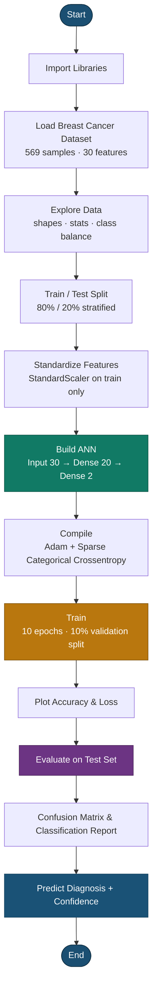
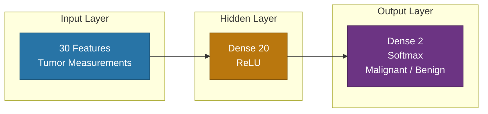

# Breast Cancer Classification with Artificial Neural Networks

[](https://www.python.org/)
[](https://www.tensorflow.org/)
[](https://keras.io/)
[](https://scikit-learn.org/)
[](docs/README.md)

A beginner-friendly **B.Tech AI mini project** that classifies breast tumors as **Malignant** or **Benign** using a compact feed-forward Artificial Neural Network (ANN) on the Breast Cancer Wisconsin dataset.

> **Test Accuracy:** ~**97.37%** &nbsp;|&nbsp; **Parameters:** 662 &nbsp;|&nbsp; **Epochs:** 10

📚 **Full documentation:** [`docs/`](docs/README.md)

---

## Table of Contents

- [Overview](#overview)
- [Features](#features)
- [Documentation](#documentation)
- [Project Workflow](#project-workflow)
- [Dataset](#dataset)
- [Model Architecture](#model-architecture)
- [Results](#results)
- [Project Structure](#project-structure)
- [Getting Started](#getting-started)
- [Tech Stack](#tech-stack)
- [Disclaimer](#disclaimer)

---

## Overview

End-to-end workflow covered in this project:

1. Load and explore the Breast Cancer Wisconsin (Diagnostic) dataset
2. Split and standardize features (no data leakage)
3. Train a simple ANN for binary classification
4. Evaluate with accuracy/loss curves, confusion matrix, and classification report
5. Run a predictive system that returns diagnosis + confidence scores

**Class labels**

| Label | Diagnosis |
|------:|-----------|
| `0` | Malignant |
| `1` | Benign |

---

## Features

- Clean, commented Jupyter notebook for beginners
- Stratified train/test split (80% / 20%)
- Feature scaling with `StandardScaler`
- Keras Sequential ANN with ReLU + Softmax
- Accuracy & loss visualization
- Confusion matrix and classification report
- Single-sample prediction with class probabilities
- Academic report (`report/`) and presentation (`presentation/`)
- Step-by-step docs in [`docs/`](docs/README.md)

---

## Documentation

| Guide | Description |
|-------|-------------|
| [Setup & Installation](docs/01_setup.md) | Environment and dependencies |
| [Dataset Guide](docs/02_dataset.md) | Features, labels, splitting, scaling |
| [Model Design](docs/03_model.md) | ANN architecture and training setup |
| [How to Run](docs/04_usage.md) | Notebook walkthrough |
| [Results & Evaluation](docs/05_results.md) | Metrics and interpretation |
| [Report & Presentation](docs/06_report_presentation.md) | PDF deliverables |

---

## Project Workflow



---

## Dataset

| Property | Value |
|----------|-------|
| Source | Breast Cancer Wisconsin (via scikit-learn) |
| Samples | 569 |
| Features | 30 numeric tumor measurements |
| Classes | Malignant (`0`), Benign (`1`) |
| Split | 80% train / 20% test (stratified) |
| Preprocessing | `StandardScaler` (fit on training data only) |

More detail: [docs/02_dataset.md](docs/02_dataset.md)

---

## Model Architecture



| Setting | Value |
|---------|-------|
| Optimizer | Adam |
| Loss | Sparse categorical cross-entropy |
| Epochs | 10 |
| Parameters | 662 |

More detail: [docs/03_model.md](docs/03_model.md)

---

## Results

| Metric | Value |
|--------|------:|
| Test Accuracy | **97.37%** |
| Test Loss | 0.1077 |
| Final Training Accuracy | 96.33% |
| Final Validation Accuracy | 95.65% |

Evaluation figures are available in `screenshots/`.  
Interpretation guide: [docs/05_results.md](docs/05_results.md)

---

## Project Structure

```text
Breast-Cancer-Project/
├── Breast_Cancer_Classification_with_Neural_Network.ipynb
├── README.md
├── requirements.txt
├── metrics.txt
├── docs/                         # Project documentation
│   ├── README.md
│   ├── 01_setup.md
│   ├── 02_dataset.md
│   ├── 03_model.md
│   ├── 04_usage.md
│   ├── 05_results.md
│   └── 06_report_presentation.md
├── screenshots/                  # Result figures & diagrams
├── report/                       # LaTeX report + PDF
└── presentation/                 # Beamer slides + PDF
```

---

## Getting Started

### 1. Install dependencies

```bash
pip install -r requirements.txt
```

### 2. Run the notebook

```bash
jupyter notebook Breast_Cancer_Classification_with_Neural_Network.ipynb
```

Or open it in VS Code / Cursor and click **Run All**.

Detailed setup: [docs/01_setup.md](docs/01_setup.md) · Usage: [docs/04_usage.md](docs/04_usage.md)

---

## Tech Stack

| Category | Tools |
|----------|-------|
| Language | Python |
| Deep Learning | TensorFlow / Keras |
| ML Utilities | scikit-learn, NumPy, Pandas |
| Visualization | Matplotlib, Seaborn |
| Notebook | Jupyter |
| Docs | Markdown + Mermaid |
| Deliverables | LaTeX report + Beamer presentation |

---

## Disclaimer

This project is for **educational / academic demonstration only**.  
It is **not** a medical device and must **not** be used for real clinical diagnosis or treatment decisions.

---

## Author

**prasansha20** — B.Tech Artificial Intelligence Mini Project

Repository: [github.com/prasansha20/Breast-Cancer-Project](https://github.com/prasansha20/Breast-Cancer-Project)
