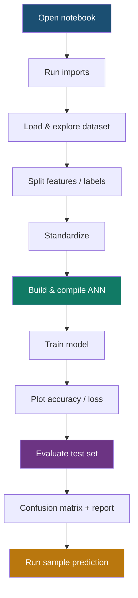

# 04 — How to Run

## End-to-End Flow



## Step-by-Step (Notebook)

### 1. Imports

Load NumPy, Pandas, Matplotlib, scikit-learn, and TensorFlow/Keras.

### 2. Data Collection

```python
breast_cancer_dataset = sklearn.datasets.load_breast_cancer()
data_frame = pd.DataFrame(
    breast_cancer_dataset.data,
    columns=breast_cancer_dataset.feature_names,
)
data_frame["label"] = breast_cancer_dataset.target
```

### 3. Separate Features and Target

```python
X = data_frame.drop(columns="label")
Y = data_frame["label"]
```

### 4. Train / Test Split + Scaling

```python
X_train, X_test, Y_train, Y_test = train_test_split(
    X, Y, test_size=0.2, random_state=2, stratify=Y
)
scaler = StandardScaler()
X_train_std = scaler.fit_transform(X_train)
X_test_std = scaler.transform(X_test)
```

### 5. Build, Compile, Train

See [03 — Model Design](03_model.md).

### 6. Evaluate

```python
test_loss, test_accuracy = model.evaluate(X_test_std, Y_test, verbose=0)
print(f"Test Accuracy: {test_accuracy * 100:.2f}%")
```

### 7. Confusion Matrix & Classification Report

```python
from sklearn.metrics import classification_report, confusion_matrix

Y_pred_labels = np.argmax(model.predict(X_test_std, verbose=0), axis=1)
print(confusion_matrix(Y_test, Y_pred_labels))
print(classification_report(Y_test, Y_pred_labels, target_names=["Malignant", "Benign"]))
```

### 8. Predictive System (Single Sample)

1. Prepare one row of 30 feature values
2. Reshape to `(1, 30)`
3. Transform with the **same** fitted scaler
4. Predict probabilities and take `argmax`
5. Print diagnosis + confidence

## Expected Outputs

After a full run you should see:

- Model summary (662 parameters)
- Training logs for 10 epochs
- Accuracy and loss plots
- Test accuracy around **97%**
- Confusion matrix and classification report
- A sample prediction such as **Benign** with high confidence

## Tips

- Always run cells **from top to bottom**
- Do not skip the scaler cell before prediction
- If accuracy looks random, check that you used `X_train_std` / `X_test_std` (scaled data)

## Next

Continue to [05 — Results & Evaluation](05_results.md).
