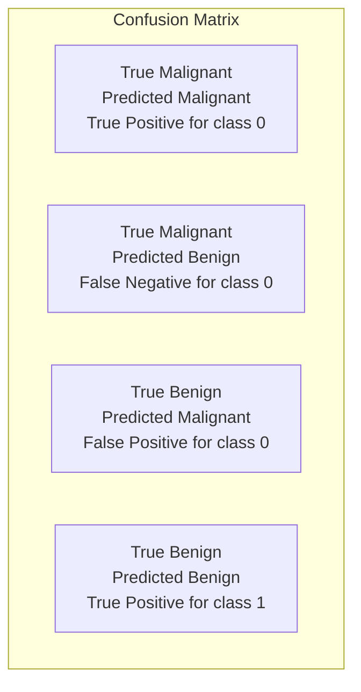

# 05 — Results & Evaluation

## Summary Metrics

Values from `metrics.txt` (latest project build):

| Metric | Value |
|--------|------:|
| Test Accuracy | **97.37%** |
| Test Loss | 0.1077 |
| Final Training Accuracy | 96.33% |
| Final Validation Accuracy | 95.65% |
| Epochs | 10 |
| Trainable Parameters | 662 |
| Test Samples | 114 |

## What Each Metric Means

| Metric | Meaning |
|--------|---------|
| **Accuracy** | Fraction of correct predictions |
| **Loss** | How far predictions are from true labels (lower is better) |
| **Precision** | Of predicted positives for a class, how many were correct |
| **Recall** | Of actual positives for a class, how many were found |
| **F1-score** | Harmonic mean of precision and recall |

## Confusion Matrix (Concept)



In medical screening contexts, missing a malignant case (false negative) is especially costly. Always review recall for the malignant class, not only overall accuracy.

## Figures in `screenshots/`

| File | Content |
|------|---------|
| `01_dataset_info.png` | Dataset summary |
| `02_dataset_overview.png` | Class distribution / feature overview |
| `03_model_summary.png` | Keras model summary |
| `04_training_progress.png` | Per-epoch train/val table |
| `05_accuracy_curve.png` | Accuracy over epochs |
| `06_loss_curve.png` | Loss over epochs |
| `07_test_accuracy.png` | Final test metrics |
| `08_confusion_matrix.png` | Confusion matrix heatmap |
| `09_classification_report.png` | Precision / recall / F1 |
| `10_prediction.png` | Sample prediction + probabilities |
| `11_workflow.png` | Project workflow diagram |
| `12_architecture.png` | ANN architecture diagram |

## Interpreting Training Curves

- **Accuracy rising** and **loss falling** → model is learning
- Large gap between train and validation → possible overfitting
- On this small, clean dataset, a compact ANN usually converges quickly within 10 epochs

## Sample Predictive Output

The notebook ends with a formatted prediction block:

```text
Predicted diagnosis   : Benign
Confidence            : ~99%
P(Malignant = 0)      : ...
P(Benign = 1)         : ...
```

## Next

Continue to [06 — Report & Presentation](06_report_presentation.md).
