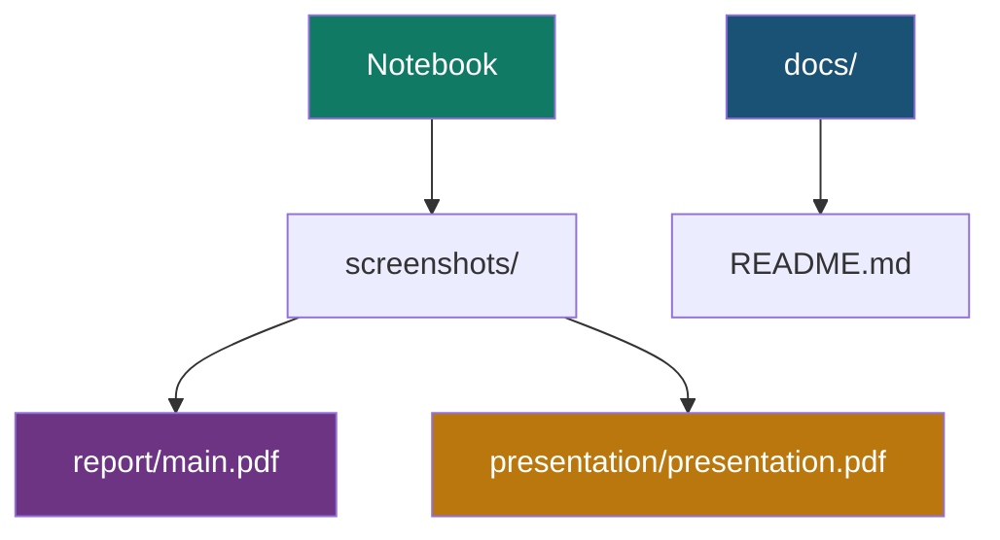

# 06 — Report & Presentation

This project ships with ready academic deliverables:

| Deliverable | Path |
|-------------|------|
| Project report (PDF) | `report/main.pdf` |
| Report source (LaTeX) | `report/main.tex` |
| References | `report/references.bib` |
| Presentation (PDF) | `presentation/presentation.pdf` |
| Presentation source | `presentation/presentation.tex` |

## Report Contents

The LaTeX report typically covers:

1. Introduction and problem statement
2. Dataset description
3. Methodology and ANN architecture
4. Training setup
5. Results (accuracy, loss, confusion matrix, classification report)
6. Predictive system demo
7. Conclusion and educational disclaimer

Figures used in the report are mirrored from `screenshots/` into `report/`.

## Presentation Contents

The Beamer slides summarize:

- Problem statement
- Dataset overview
- Model architecture
- Training curves
- Test results and confusion matrix
- Prediction demo
- Workflow and conclusion

## Recompiling (Optional)

If LaTeX is installed:

```bash
cd report
pdflatex main.tex
bibtex main
pdflatex main.tex
pdflatex main.tex

cd ../presentation
pdflatex presentation.tex
pdflatex presentation.tex
```

## Customizing for Submission

Before submitting, update:

- Student name
- College / department
- Roll number (if required)
- Guide / mentor name

in:

- `report/main.tex`
- `presentation/presentation.tex`

## Documentation Map



## Disclaimer

All report and presentation materials are for **educational use only** and are **not** clinical diagnostic tools.

---

**Back to:** [Documentation Home](README.md) · [Project README](../README.md)
